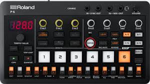

# p6-wave-slice

<p align="center">
  
</p>

A small, focused command-line utility for turning collections of WAV samples into evenly-sliced, P‑6‑ready files. It targets the [Roland P-6 Creative Sampler](https://www.roland.com/global/products/p-6/) **Chop** workflow, but works for any sampler that expects equal-length slices in a single WAV.

## Background

The Roland P-6 has a **Chop** feature in Sample Edit (Voice) mode that splits a sample into equal parts and assigns each slice to note numbers from C4 to D#9 (up to 64 slices). This is great for quickly auditioning and playing multiple samples from a single voice slot.

However, preparing samples for this workflow manually is tedious:

- Samples need matching sample rates and channel configurations
- Each slice needs to be the same duration
- Leading silence should be trimmed
- Files need to fit within the sampler's memory constraints

**p6-wave-slice** automates this. Point it at a folder, give it a search pattern like "kick" or "snare", and it will:

1. Recursively find all matching WAV files
2. Show you a summary of what was found
3. Batch-process them into combined WAV files ready for Chop mode

## How it works

```
Folder of samples              wavslice                    P-6 Chop
 ├─ kick_001.wav     ──┐                              ┌──  C4: slice 1
 ├─ kick_002.wav       │    ┌──────────────────┐      │    C#4: slice 2
 ├─ kick_003.wav       ├───▶│ kick_32slices_   │──────┤    D4: slice 3
 └─ ...                │    │ batch001.wav     │      │    ...
     (32 files)      ──┘    └──────────────────┘      └──  D#6: slice 32
```

Each sample is:
- Resampled to the target rate
- Converted to mono/stereo as needed
- Trimmed of leading silence
- Padded or truncated to exact slice length
- Concatenated into the final output file

## Features

- **Recursive file search** with pattern matching (e.g., "kick" finds all `*kick*.wav` files)
- **Automatic resampling** to target sample rate (44100, 22050, 14700, or 11025 Hz)
- **Channel conversion** (mono ↔ stereo)
- **Leading silence removal** — trims dead air at the start of samples
- **Automatic padding/truncation** — ensures each slice is exactly the right duration
- **Multiple format support** — PCM (8/16/24/32-bit), IEEE Float (32/64-bit), and Extensible WAV
- **Batch output** — creates multiple output files if you have more samples than slices
- **Optional normalization** — maximize volume of the combined output

## Installation

### From source (requires Go 1.21+)

```bash
go build -o wavslice main.go
```

### Prebuilt binaries

Prebuilt binaries are available in the `dist/` folder for:

- macOS (Intel and Apple Silicon)
- Linux (amd64 and arm64)
- Windows (amd64)

To verify a download:

```bash
# macOS
shasum -a 256 dist/wavslice-darwin-arm64

# Linux
sha256sum dist/wavslice-linux-amd64
```

Compare the output to the corresponding entry in `dist/SHA256SUMS`.

## Usage

```bash
./wavslice -pattern <search> [options]
```

### Options

| Flag | Description | Default |
|------|-------------|---------|
| `-pattern` | Search pattern (e.g., "kick", "snare", "hat") | *required* |
| `-dir` | Directory to search for WAV files | `.` |
| `-output` | Output directory for combined WAV files | `.` |
| `-rate` | Output sample rate: 44100, 22050, 14700, or 11025 Hz | `44100` |
| `-slices` | Number of slices per output file (1–64) | `32` |
| `-stereo` | Output stereo instead of mono | `false` |
| `-normalize` | Normalize volume before saving | `false` |

### Examples

**Find all kick samples and create 32-slice mono files at 44.1kHz:**

```bash
./wavslice -pattern "kick" -dir ~/samples -output ./output
```

**Create 64-slice stereo snare compilation at 22.05kHz:**

```bash
./wavslice -pattern "snare" -rate 22050 -slices 64 -stereo -output ./output
```

**Quick 16-slice hihat pack with normalization:**

```bash
./wavslice -pattern "hat" -slices 16 -normalize -output ./output
```

### Output

Output files are named: `{pattern}_{slices}slices_batch{NNN}.wav`

For example: `kick_32slices_batch001.wav`, `kick_32slices_batch002.wav`, etc.

## Slice duration reference

Based on the P-6's ~260,000 sample frame limit:

| Sample Rate | Channels | Max Duration | 32 Slices | 64 Slices |
|-------------|----------|--------------|-----------|-----------|
| 44.1 kHz    | Mono     | 5.9s         | 184ms     | 92ms      |
| 22.05 kHz   | Mono     | 11.8s        | 369ms     | 184ms     |
| 14.7 kHz    | Mono     | 17.8s        | 556ms     | 278ms     |
| 11.025 kHz  | Mono     | 23.7s        | 741ms     | 370ms     |
| 44.1 kHz    | Stereo   | 2.95s        | 92ms      | 46ms      |
| 22.05 kHz   | Stereo   | 5.9s         | 184ms     | 92ms      |

**Tip:** For kicks, 80ms+ is usually sufficient. For snares, aim for 120ms+. Use a lower sample rate or mono output if you need longer slice durations.

## Workflow

1. Run `wavslice` with your search pattern
2. Review the summary of found files (sample rates, durations, channels)
3. Confirm to proceed
4. Transfer the output WAV files to your P-6 via USB
5. Load a file and use **Chop** mode to split it into slices
6. Play the slices from C4 upward!

## Development

```bash
# Run tests
make test

# Run tests with coverage
make cover

# Build for current platform
make build

# Build all platforms
make all
```

## License

[Unlicense](LICENSE) — public domain, no warranty.
